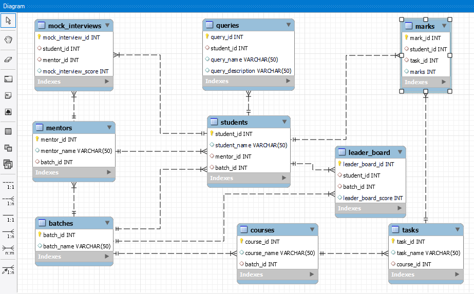

## DB Model for Guvi-Zen Class

### Overview

This project involves designing a comprehensive database for managing the Guvi Zen class using MySQL. The schema includes tables for batches, mentors, courses, tasks, students, marks, queries, mock interviews, and the leader board.

### Database Schema

The schema includes the following tables:

1. **Batches**: Information about different batches.
2. **Mentors**: Mentors and their associated batches.
3. **Courses**: Courses offered in each batch.
4. **Tasks**: Tasks related to courses.
5. **Students**: Students, their mentors, and batches.
6. **Marks**: Students' marks for tasks.
7. **Queries**: Queries raised by students.
8. **Mock Interviews**: Mock interview scores.
9. **Leader Board**: Leader board scores within batches.

### Lessons Learned

- CRUD Operations
- Creating and Altering Tables
- Table Constraints (Primary and Foreign Keys)
- Using MySql WorkBench
- Designing DB Diagrams

### Features

- Manage batches, mentors, courses, tasks, and students
- Record marks and grades
- Track student queries
- Record mock interview scores
- Maintain leader board scores

### Conclusion

This project demonstrates the design and implementation of a robust database model for the Guvi Zen class.
